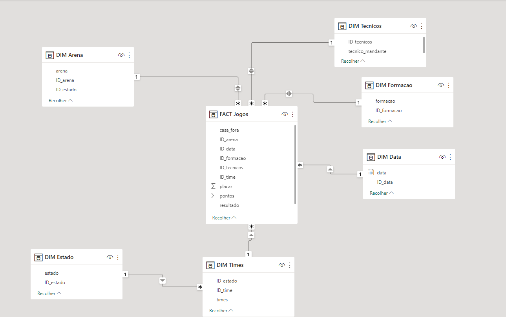

# ⚽ Dashboard Esportivo: Campeonato Brasileiro (Série A)

  
  
  

 

> **Objetivo:** Desenvolvimento de Dashboards interativos e modelagem de dados no Power BI para analisar o desempenho de clubes, formações táticas e estatísticas gerais do Campeonato Brasileiro (Série A) no período de 2003 a 2021.

---

## 🎯 Visão Geral do Projeto

Este projeto de Data Visualization foi dividido em duas frentes de negócio (análise esportiva):

1. **Visão Macro (Consultoria DNC):** Uma visão geral e geográfica dos maiores pontuadores do campeonato ao longo de quase duas décadas.
2. **Visão Micro (Análise de Torcedor/Tática):** Um detalhamento granular do desempenho de times específicos, focando em eficiência de treinadores, sucesso de formações táticas (ex: 4-4-2 vs 4-3-3) e performance por estádio.

👉 **[Fazer o download do Dashboard (.pbix)](campeonato-brasileiro.pbix)**

---

## 🗂️ O Dataset e a Modelagem

**Fonte de Dados:** Planilha `.CSV` contendo o histórico oficial de todas as partidas da Série A desde a transição para o formato de pontos corridos (2003) até 2021.

**Arquitetura (Star Schema):**
Para garantir o desempenho do dashboard e facilitar futuras atualizações de dados do Brasileirão, a tabela "flat" original passou por um processo de ETL (Extração, Transformação e Carga) no Power Query e foi modelada no padrão **Fato-Dimensão (Star Schema)**.

---

## 💡 Perguntas Analíticas Respondidas

<b>📊 1. Visão Geral do Campeonato (Macro)</b>

 

* Quais os times e estados com maior número histórico de gols?
* Qual a taxa de sucesso e número de gols separando Mandantes vs. Visitantes ao decorrer dos meses?
* Quais os 5 times mandantes mais letais do Brasil? E os 5 visitantes?

<b>📋 2. Análise Tática e Desempenho do Time (Micro)</b>

 

* **Análise Tática:** Qual a formação mais utilizada pelo clube selecionado? Qual formação obteve a maior taxa de conversão em vitórias?
* **Análise de Liderança:** Qual técnico trouxe a maior média de pontos e vitórias para a equipe?
* **Fator Casa:** Em qual estádio o time possui sua maior "fortaleza" (taxa de vitórias)?
* **Comparativo de Tabela:** Como o time se saiu contra o "Top 3" (melhores do ano) e contra o "Bottom 4" (zona de rebaixamento)?

---

## 📸 Telas do Dashboard

### 1. Dashboard de Análises Gerais (Visão do Campeonato)

### 2. Dashboard de Análise Tática dos Times (Visão Específica)

---
*Este repositório faz parte do meu portfólio de Visualização de Dados e BI, demonstrando capacidade de ETL, modelagem Star Schema e criação de dashboards focados em UX/UI.*
