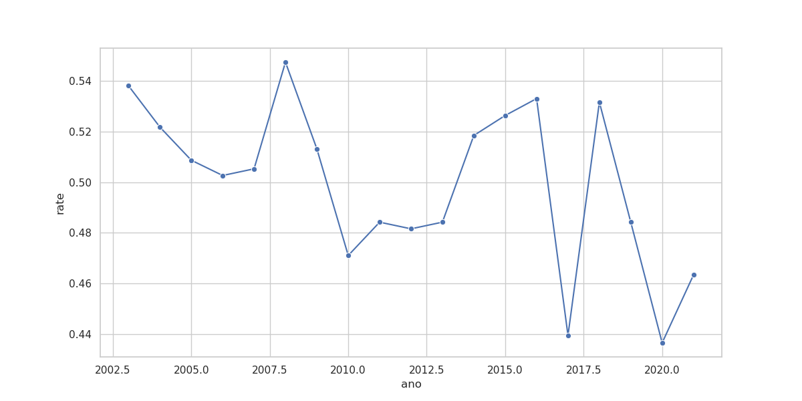
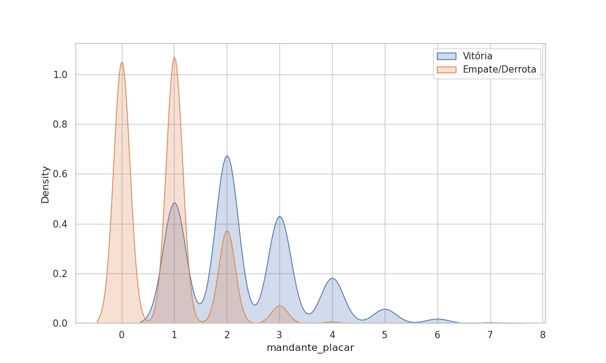

# 📊 Análise Estatística & EDA (Exploratory Data Analysis)

Nesta etapa, elevamos a análise para o nível de **Ciência de Dados**, utilizando Python para testar hipóteses e identificar padrões comportamentais no futebol brasileiro (2003-2021).

## 🏠 Hipótese 1: O Declínio do "Fator Casa"
Historicamente, jogar em casa é uma vantagem massiva. Mas essa vantagem é constante ou está diminuindo com a modernização do esporte (melhores gramados, viagens mais rápidas, VAR)?



### 🧐 Insights da Hipótese:
- **Resistência Histórica:** A média de vitórias em casa gira em torno de **49%**.
- **Volatilidade:** Notamos quedas bruscas em anos específicos, sugerindo que o equilíbrio técnico do campeonato flutua, mas a "mística" do mando ainda é o fator individual mais forte na conquista de pontos.

## 🥅 Hipótese 2: O "Limiar da Vitória" (Goal Density)
Quantos gols um mandante precisa fazer para garantir estatisticamente os 3 pontos?



### 🧐 Insights da Hipótese:
- **A Barreira dos 2 Gols:** A curva verde (vitória) atinge seu ápice quando o mandante marca **2 ou mais gols**. 
- **Risco Estatístico:** Marcar apenas 1 gol em casa coloca o mandante em uma zona de "alta densidade de empates/derrotas", mostrando que a eficiência ofensiva é mais determinante que a retranca defensiva para garantir o resultado em casa.

## 🚀 Ranking de Resiliência (Top 10 Visitantes)
Identificamos os clubes que melhor performam sob pressão (fora de casa). Esta análise é vital para entender quem são os verdadeiros "donos" do campeonato, independentemente do estádio.

```python
# Média de pontos conquistados como visitante (Aproveitamento)
visitante_pts = df.groupby('visitante')['pontos_visitante'].mean().sort_values(ascending=False)
```

---
*Esta análise transforma números frios em inteligência competitiva, provando que o tratamento de dados com Python permite enxergar o que o olho humano ignora.*


