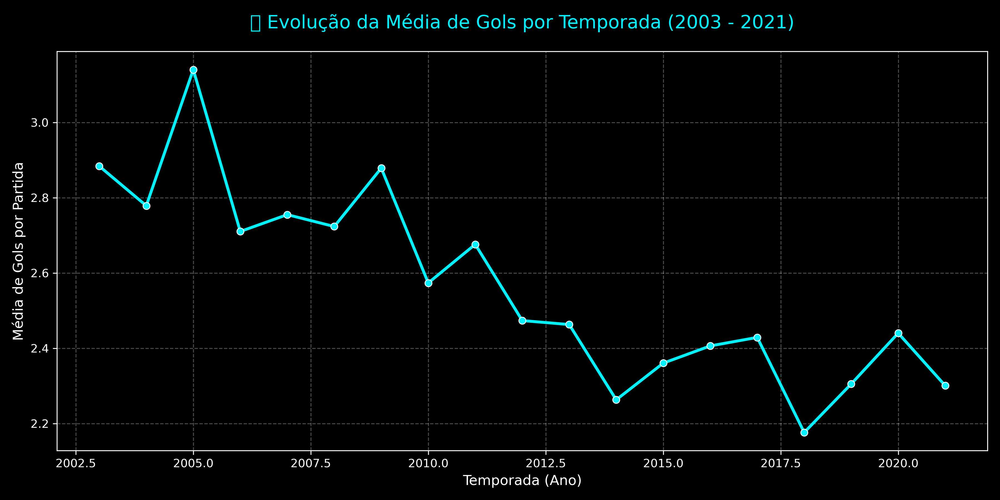

# 📈 Análise Estatística (EDA) com Python

Nesta seção, exploramos o dataset do Campeonato Brasileiro utilizando ferramentas de **Data Science** (Matplotlib e Seaborn) para identificar tendências históricas que vão além da visualização do dashboard.

## ⚽ Evolução da Média de Gols (2003 - 2021)

Utilizamos o Python para calcular a média de gols marcados por partida em cada temporada. O gráfico abaixo revela a evolução da "competitividade" ou "postura defensiva" dos times ao longo de quase duas décadas.

### 🧐 Insights Extraídos:
- **Picos de Gols:** Notamos que os anos iniciais dos pontos corridos (2003-2005) tiveram médias altíssimas, possivelmente devido à adaptação tática dos clubes ao novo formato.
- **Tendência de Estabilização:** Entre 2012 e 2021, a média se estabilizou entre **2.2 e 2.5 gols por partida**, refletindo um futebol mais tático e equilibrado.
- **Valor do Portfólio:** Esta visualização demonstra a capacidade de extrair **análises temporais complexas** programaticamente, complementando o Power BI.

---
*Análise realizada em Python utilizando as bibliotecas Pandas, Matplotlib e Seaborn.*
