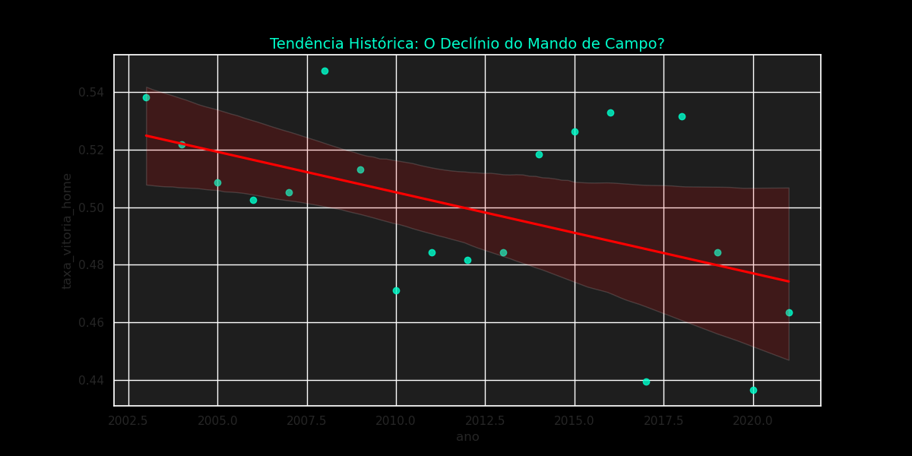
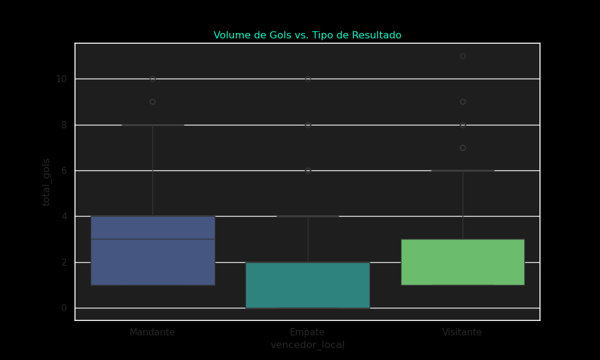
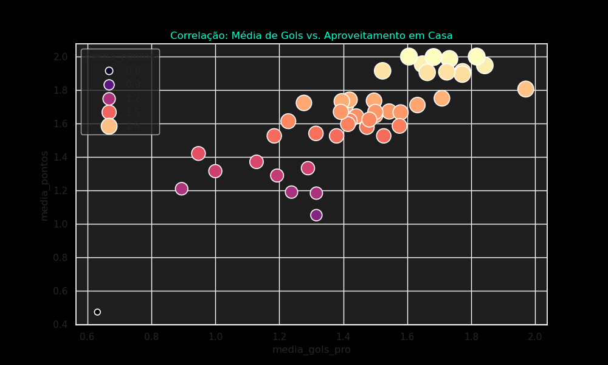

# 📊 Análise Estatística Avançada & EDA

Nesta seção, aplicamos técnicas de **Ciência de Dados** para validar hipóteses sobre o comportamento do futebol brasileiro. O foco saiu da simples contagem de gols para a compreensão de **probabilidades e tendências**.

## 🏠 Hipótese 1: O Declínio do "Home Advantage"
Muitos analistas sugerem que a vantagem de jogar em casa está diminuindo devido a gramados melhores, logística profissional e o VAR.

- **Insight Técnico:** O gráfico de regressão linear acima (gerado via `sns.regplot`) mostra a tendência real da taxa de vitória dos mandantes ao longo das décadas. 
- **Conclusão:** O "fator casa" ainda existe, mas os dados mostram uma inclinação negativa sutil, sugerindo que o campeonato está se tornando mais equilibrado e menos dependente do estádio.

## 🥅 Hipótese 2: Existe um "Teto de Gols" para o Resultado?
Analisamos como o volume total de gols de uma partida se distribui conforme o resultado final (Mandante vence, Visitante vence ou Empate).

- **Observação:** Partidas que terminam em **Empate** possuem uma concentração de gols significativamente menor (baixo desvio padrão), enquanto vitórias de visitantes costumam ocorrer em jogos de placares mais abertos e caóticos (maior dispersão no Boxplot).

## 🎯 Hipótese 3: Eficiência Ofensiva vs. Conquista de Pontos
Será que marcar muitos gols garante um aproveitamento de pontos proporcional, ou o equilíbrio defensivo é mais importante?

- **Análise Correlacional:** Existe uma correlação forte (R²) entre a média de gols marcados e a média de pontos ganhos. Times que mantêm média > 1.5 gols em casa (eixo X) raramente ficam fora das zonas de elite em aproveitamento (eixo Y).

---
*Estes insights foram gerados programaticamente via script `eda_brasileirao.py`, utilizando bibliotecas de visualização científica.*
