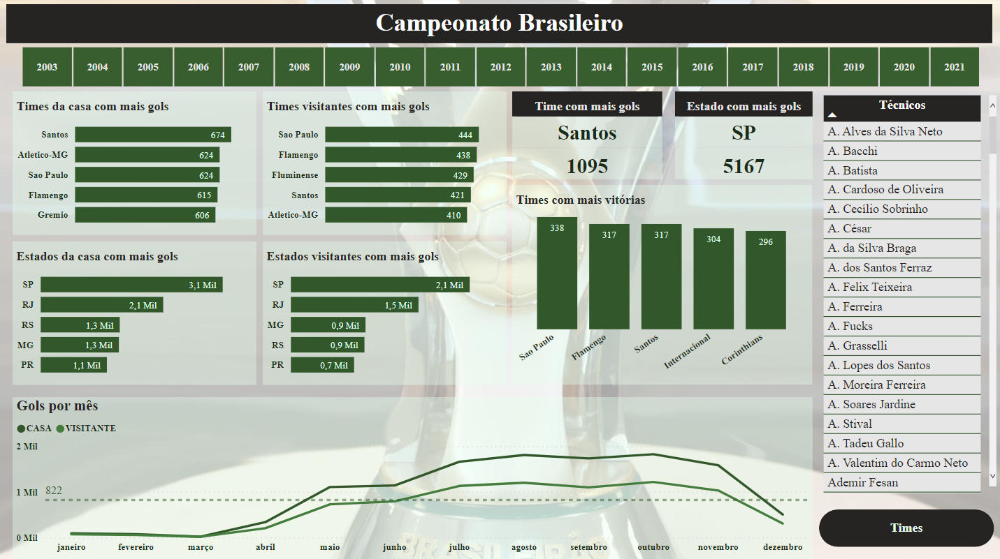
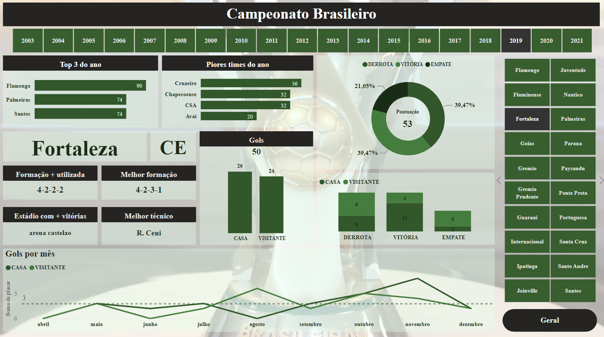

# ⚽ Dashboard Esportivo: Campeonato Brasileiro

!!! abstract "Objetivo"
    Desenvolvimento de Dashboards interativos e modelagem de dados no Power BI para analisar o desempenho de clubes, formações táticas e estatísticas gerais do Campeonato Brasileiro (Série A) no período de **2003 a 2021**.

---

## 🎯 Visão Geral do Projeto

Este projeto de Data Visualization foi dividido em duas frentes de negócio:

=== "🏙️ Visão Macro (Consultoria)"
    Uma visão geral e geográfica dos maiores pontuadores do campeonato ao longo de quase duas décadas. Foco em tendências regionais e dominância histórica.

=== "📉 Visão Micro (Tática)"
    Detalhamento granular do desempenho de times específicos, focando em:
    - Eficiência de treinadores.
    - Sucesso de formações táticas (ex: 4-4-2 vs 4-3-3).
    - Performance por estádio (Fator Casa).

---

## 📸 Demonstração

### 1. Análises Gerais (Visão do Campeonato)

### 2. Análise Tática dos Times

---

## 🛠️ Stack Técnica e Modelagem

*   **Ferramenta de BI:** Power BI
*   **ETL:** Power Query (M Language)
*   **Banco de Dados:** Histórico oficial (Série A) 2003-2021.
*   **Arquitetura:** Star Schema (Fato-Dimensão).

### Modelagem de Dados
Para garantir performance analítica, a tabela original foi normalizada para o padrão Star Schema:

---

## ❓ Perguntas Analíticas Respondidas

???+ question "Quais os segredos táticos do Brasileirão?"
    - **Formação:** Qual esquema tático converte mais pontos?
    - **Liderança:** Qual técnico possui a melhor média histórica por clube?
    - **Geografia:** Quais estados dominam o topo da tabela histórico?

---

## 🚀 Como Explorar
1.  Faça o download do arquivo [campeonato-brasileiro.pbix](campeonato-brasileiro.pbix).
2.  Abra no Power BI Desktop.
3.  Utilize os filtros laterais para navegar entre as temporadas.

---
*Este repositório faz parte do portfólio de Visualização de Dados de **Ariel Shlomoh**.*
